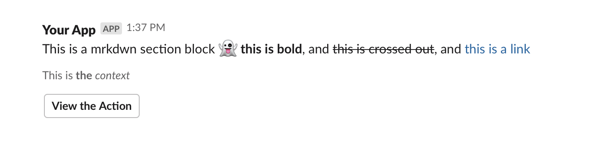

# Slack Message Action

A composable slack message action.

This slack action takes text inputs and composes a slack message with a body, context and button.



To set it up you need to configure a [slack app with an incoming webhook](https://api.slack.com/messaging/webhooks), and set that url as a secret on your repo.

```
jobs:
  build:
    runs-on: macOS-10.14
    steps:
      - name: Checkout code
        uses: actions/checkout@master
      - name: Create Release
        id: create_release
        uses: actions/create-release@v1.0.0
        env:
          GITHUB_TOKEN: ${{ secrets.GITHUB_TOKEN }}
        with:
          tag_name: ${{ github.ref }}
          release_name: Release ${{ github.ref }}
      - name: Set Info
        id: info
        run: echo "::set-output name=version::v1.0.0"
      - name: Slack
        uses: csexton/slack-message-action@v1
        with:
          slack-webhook-url: ${{ secrets.SLACK_WEBHOOK_URL }}
          message: |
            New build was kicked off by *${{ github.actor }}*
          summary: New build
          context: Version ${{ steps.info.outputs.version }} for the ${{ github.workflow }} workflow
          button-text: View on GitHub
          button-url: ${{ steps.release.outputs.url }}


